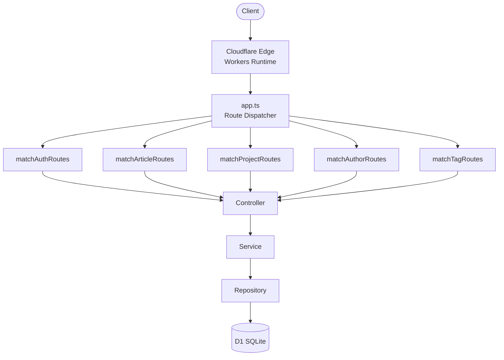
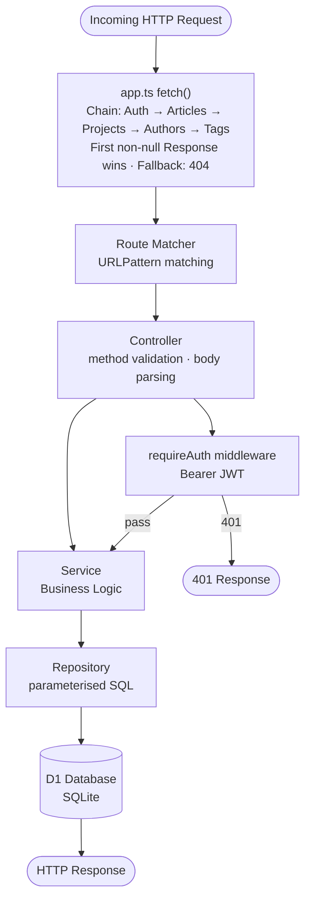
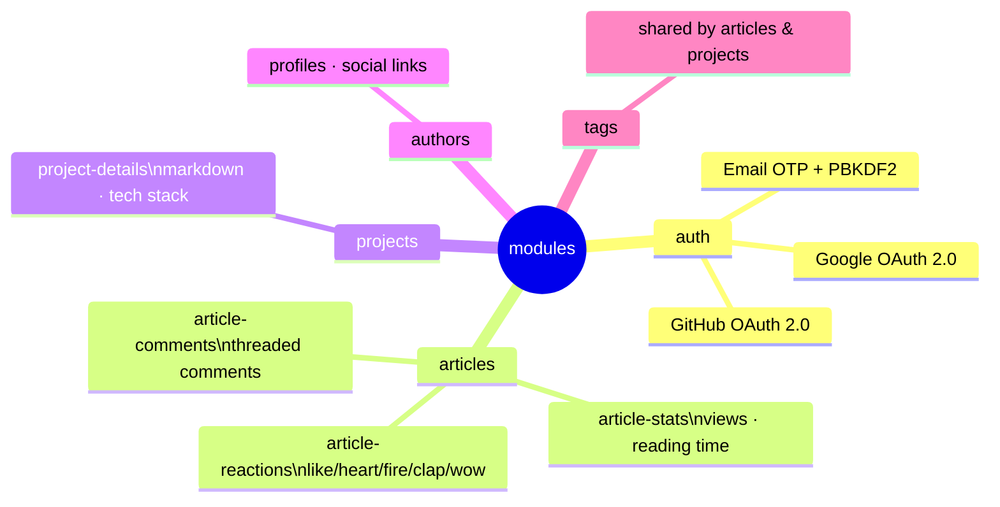
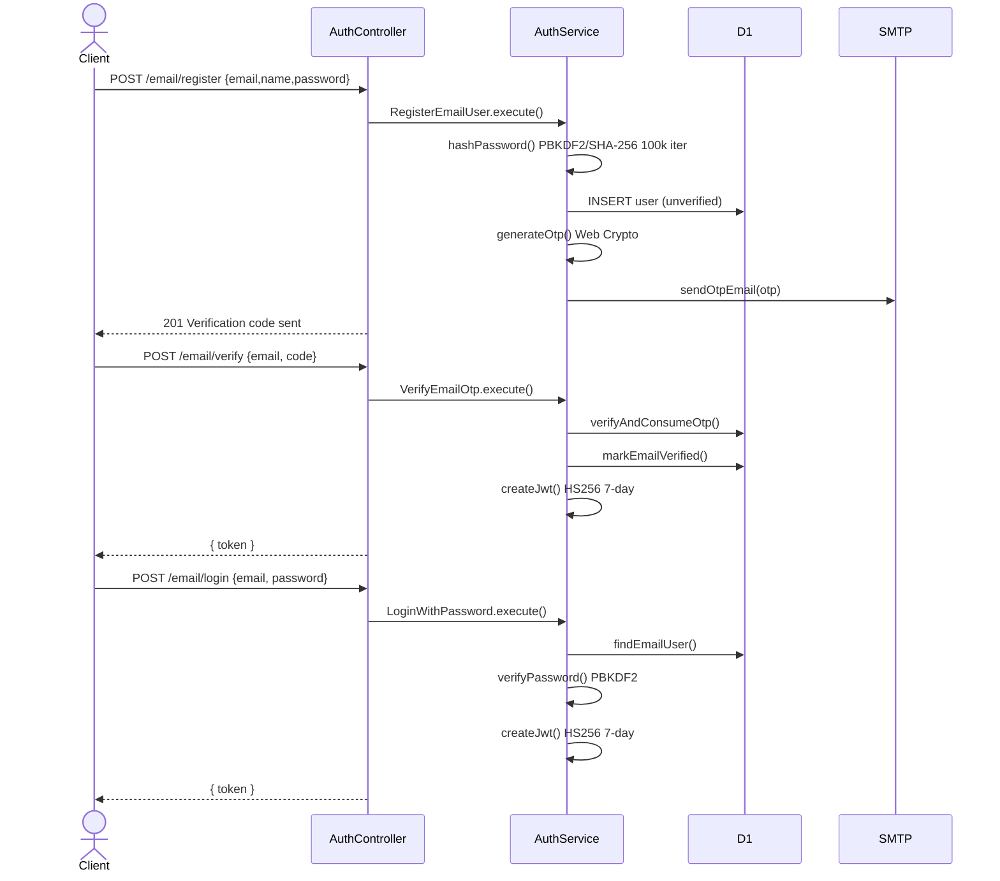
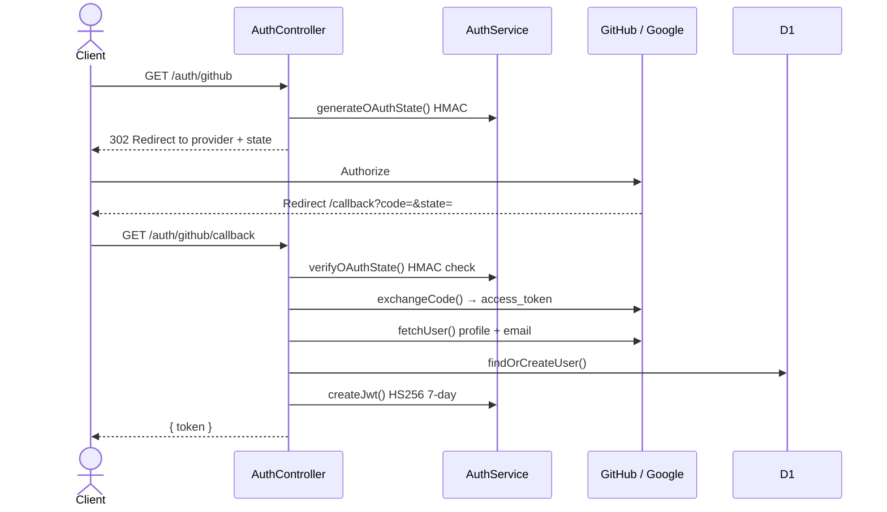
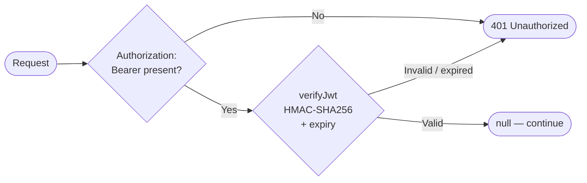
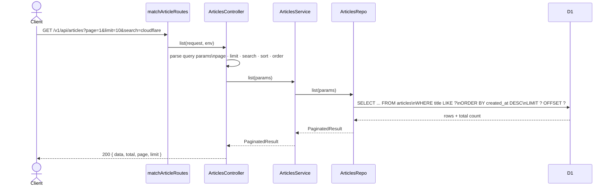
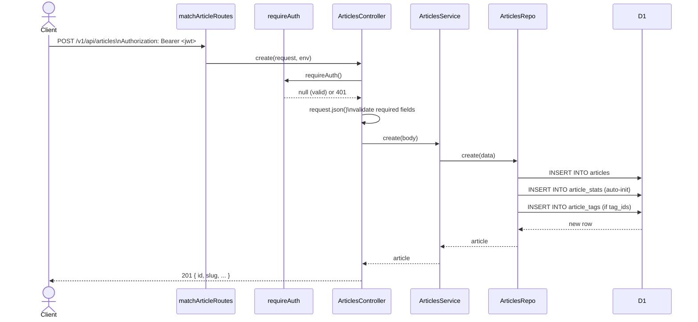
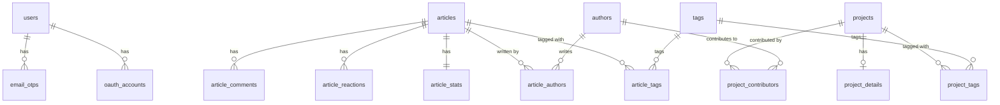

# Architecture Flow — api.pphat.me

> Version 0.8.2 · Cloudflare Workers + D1

---

## Overview

---

## Request Lifecycle

---

## Layer Responsibilities

| Layer | Files | Responsibility |
|-------|-------|----------------|
| **Entry Point** | `apps/app.ts` | Receives `fetch` event, chains route matchers, returns 404 fallback |
| **Route** | `*.route.ts` / `*.routes.ts` | `URLPattern` matching, dispatch to controller |
| **Middleware** | `middlewares/auth.middleware.ts` | Validates `Authorization: Bearer <JWT>`, returns `401` or `null` |
| **Controller** | `*.controller.ts` | HTTP method checks, request body parsing, calls service/use-case |
| **Service** | `*.service.ts` | Business logic, use-case classes, crypto helpers |
| **Repository** | `*.repo.ts` | SQL queries against D1, data mapping |
| **Shared** | `shared/helpers/`, `shared/interfaces/` | `json()` helper, `response()` helper, shared TypeScript types |

---

## Module Map

---

## Authentication Flow

### Email / Password

### OAuth (GitHub / Google)

### JWT Verification (protected routes)

---

## Data Flow — Read Example (GET /v1/api/articles)

---

## Data Flow — Write Example (POST /v1/api/articles)

---

## Database Schema (D1 / SQLite)

---

## Environment Bindings

| Binding | Type | Purpose |
|---------|------|---------|
| `DB` | D1Database | Primary SQLite database |
| `JWT_SECRET` | Secret | HMAC key for JWT signing + OAuth CSRF state |
| `GITHUB_CLIENT_ID` | Var | GitHub OAuth app client ID |
| `GITHUB_CLIENT_SECRET` | Secret | GitHub OAuth app client secret |
| `GOOGLE_CLIENT_ID` | Var | Google OAuth app client ID |
| `GOOGLE_CLIENT_SECRET` | Secret | Google OAuth app client secret |
| `APP_URL` | Var | Canonical base URL (OAuth redirect URIs) |
| `SMTP_HOST` | Var | SMTP server hostname |
| `SMTP_PORT` | Var | SMTP server port |
| `SMTP_USER` | Var | SMTP sender display name + address |
| `SMTP_FROM` | Var | SMTP from address |
| `SMTP_PASS` | Secret | SMTP password |

---

## Error Response Conventions

| Status | Meaning |
|--------|---------|
| `400` | Bad request / invalid body / invalid OTP |
| `401` | Missing or invalid JWT |
| `403` | Email not yet verified |
| `404` | Resource not found |
| `405` | HTTP method not allowed |
| `409` | Slug or email already exists |
| `422` | Validation error (missing fields / invalid tag IDs) |
| `502` | Upstream OAuth provider failure |
